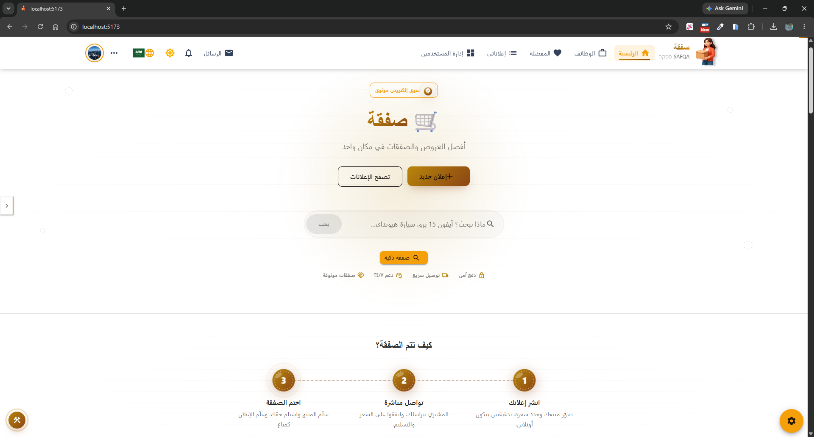
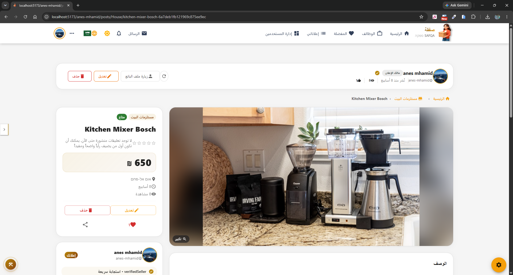
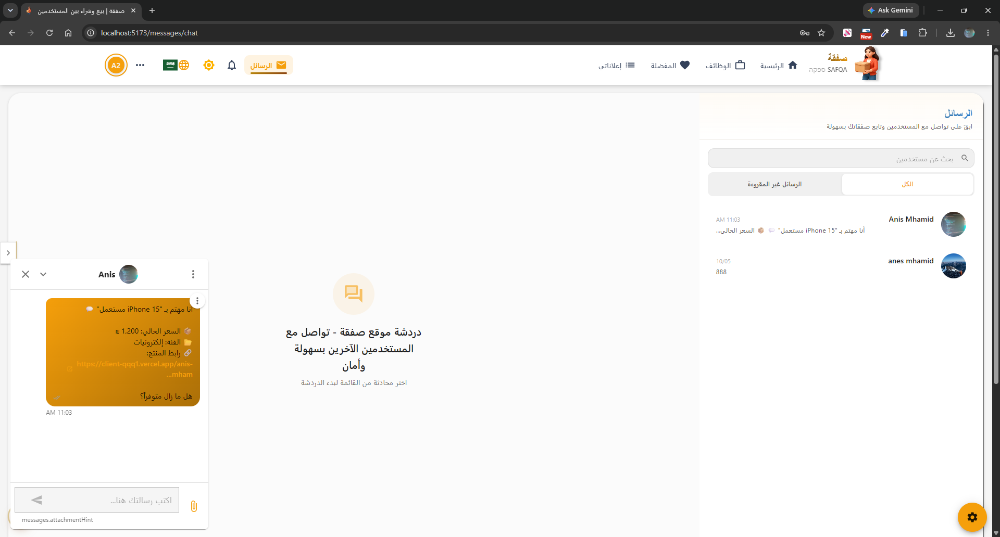
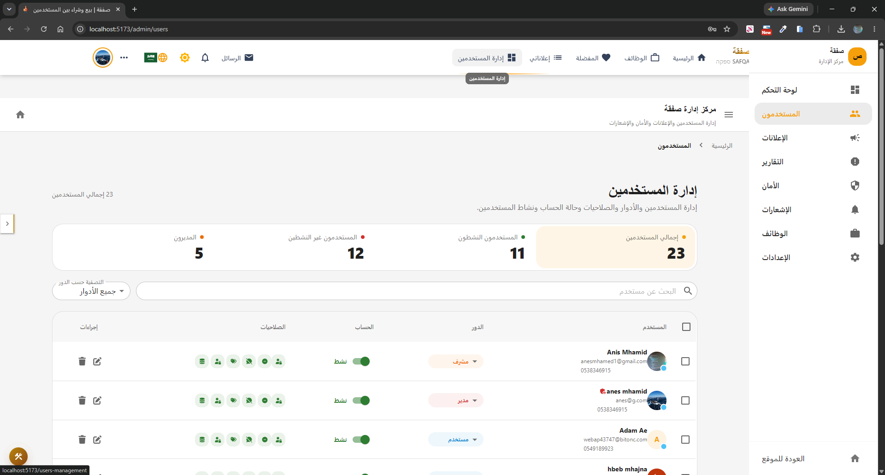
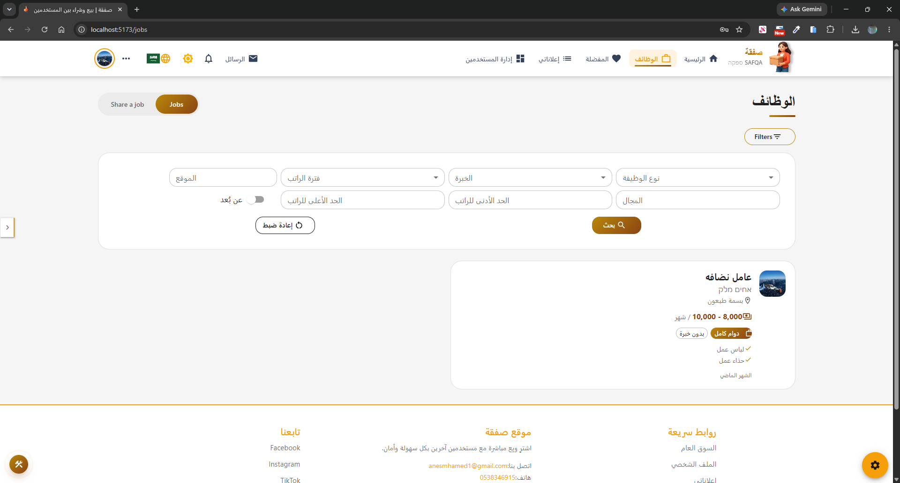
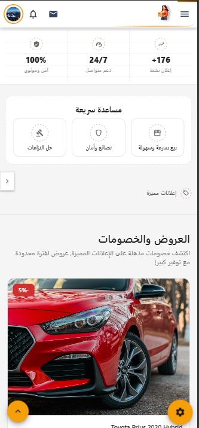

# Safqa Marketplace | C2C Marketplace Frontend

A modern consumer-to-consumer marketplace frontend built with React, TypeScript, and Vite, designed to let users buy and sell products securely across multiple categories.

Safqa supports authentication, real-time chat, ad management, product discovery, jobs, notifications, moderation, and role-based administration in a responsive, mobile-friendly experience.


This client connects to a backend API and Socket.IO event server.

**Backend repository:** [github.com/Anismhamid/server](https://github.com/Anismhamid/server)

## Screenshots

| Home | Product Details | Messages |
| --- | --- | --- |
|  |  |  |

| Admin Center | Jobs | Mobile (Android) |
| --- | --- | --- |
|  |  |  |

## What's New

- Centralized Admin Center with improved navigation.
- Enhanced user management, roles, and permission controls.
- Improved product and advertisement moderation.
- Jobs management with search, filtering, and pagination.
- Notification management and broadcasting.
- Message audit logs and user block management.
- Real-time messaging with read/delivery states and push notifications.
- Improved responsive UI, localization, and stability.
- Hardened frontend security practices and backend authorization handling.

## Table of Contents

- [Overview](#overview)
- [Key Features](#key-features)
- [Tech Stack](#tech-stack)
- [Prerequisites](#prerequisites)
- [Getting Started](#getting-started)
- [Environment Variables](#environment-variables)
- [Scripts](#scripts)
- [Android (Capacitor)](#android-capacitor)
- [Project Structure](#project-structure)
- [Main Routes](#main-routes)
- [Jobs Platform](#jobs-platform)
- [Admin Center](#admin-center)
- [Security & Stability](#security--stability)
- [Contributing](#contributing)
- [License](#license)

## Overview

Safqa Marketplace is a feature-rich frontend for a C2C trading platform where people discover, list, and negotiate the sale of products.

Supported listings:

- Vehicles
- Electronics
- Home and garden items
- Fashion and accessories
- Health and beauty products
- Everyday essentials
- Miscellaneous goods
- Services
- Jobs

User journeys include browsing and filtering listings, messaging sellers, managing favorites, creating ads, viewing profiles, discovering jobs, and using administrative tools.

## Key Features

### Marketplace

- Responsive UI built with React and Material UI
- Category browsing with filters
- Search and discovery
- Product details and seller profiles
- Favorites and saved listings
- Premium and featured ad management
- Product sharing and external navigation integrations

### Authentication & Accounts

- Registration and login
- Google OAuth login
- Role-based access control
- Account status management
- Permission-based feature access
- Profile management

### Messaging

- Real-time messaging with Socket.IO
- Conversation management
- Message editing and deletion
- Read and delivery states
- Typing indicators
- Unread indicators
- Push notifications

### Jobs

- Job listing creation and management
- Search, filtering, and pagination
- Job details pages
- User-based job retrieval
- Administrative job management

### Administration

- Centralized Admin Center
- User management
- Advertisement moderation
- Reports and moderation
- Jobs administration
- Notification Center
- Message Audit Logs
- User Blocks management
- Role and permission management
- Backend-enforced administrative authorization
- Pagination and filtering for administrative datasets

### Platform

- Dark and light themes
- Arabic (RTL), Hebrew, and English localization
- SEO-friendly pages and structured metadata
- Android app via Capacitor
- Mobile-first responsive architecture

## Tech Stack

### Frontend

| Category | Technology |
| --- | --- |
| Framework | React 19 |
| Build Tool | Vite |
| Language | TypeScript |
| Routing | React Router DOM |
| UI Library | Material UI (primary), Bootstrap 5 (grid and utilities) |
| Forms | Formik + Yup |
| Real-time | Socket.IO Client |
| Charts | Recharts |
| Icons | Font Awesome + Lucide |
| Toasts | react-toastify |
| i18n | react-i18next |

### Integrations

| Integration | Purpose |
| --- | --- |
| Capacitor | Android / hybrid app packaging |
| Google OAuth | Social authentication |
| `<PDF_LIBRARY>` | PDF generation and export |
| Context + Hooks | State management and application logic |

## Prerequisites

- Node.js 20 or newer
- npm or yarn
- A running backend API (see the [server repository](https://github.com/Anismhamid/server))

## Getting Started

### 1. Clone the repository

```bash
git clone https://github.com/Anismhamid/client.git
cd client
```

### 2. Install dependencies

```bash
npm install
```

### 3. Configure environment variables

Create a `.env` file in the project root:

```env
VITE_API_URL=http://localhost:8209/api
VITE_SOCKET_URL=http://localhost:8209
VITE_GOOGLE_CLIENT_ID=your_google_client_id_here
```

Adjust the values if the backend runs on a different host or port.

### 4. Run in development

```bash
npm run dev
```

- Frontend: http://localhost:5173
- Backend API: http://localhost:8209

### 5. Build for production

```bash
npm run build
npm run preview
```

## Environment Variables

| Variable | Description |
| --- | --- |
| `VITE_API_URL` | Base URL of the backend API |
| `VITE_SOCKET_URL` | Socket.IO server URL |
| `VITE_GOOGLE_CLIENT_ID` | Google OAuth client ID |

## Scripts

| Command | Description |
| --- | --- |
| `npm run dev` | Start the Vite dev server |
| `npm run build` | Type-check and build for production |
| `npm run preview` | Serve the production build locally |
| `npm run lint` | Run ESLint |

## Android (Capacitor)

```bash
npm run build          # build the web assets first
npx cap sync android   # copy assets and update native plugins
npx cap open android   # open the project in Android Studio
```

Re-run `npm run build` and `npx cap sync android` after every frontend change you want reflected in the app.

## Project Structure

```
client/
├── public/            # Static assets
├── src/
│   ├── App.tsx        # Main app component
│   ├── main.tsx       # React entry point
│   ├── assets/        # Images, icons, static assets
│   ├── atoms/         # Small reusable UI elements
│   ├── components/    # Feature UI components
│   ├── context/       # Context providers
│   ├── helpers/       # Utility functions
│   ├── hooks/         # Custom hooks
│   ├── interfaces/    # TypeScript types
│   ├── locales/       # Localization files
│   ├── routes/        # Routing configuration
│   ├── services/      # API and integration services
│   ├── socket/        # Socket.IO logic
│   └── index.css      # Core styles
├── android/           # Capacitor Android project
├── package.json
├── vite.config.ts
├── vercel.json        # Deployment and security headers
├── tsconfig*.json
├── LICENSE
└── README.md
```

## Main Routes

### Core Pages

| Route | Description |
| --- | --- |
| `/` | Homepage |
| `/login` | Login |
| `/register` | Registration |
| `/profile` | User profile |
| `/messages` | Messaging center |
| `/favorites` | Saved listings |
| `/about` | About |
| `/contact` | Contact |
| `/privacy-and-policy` | Privacy policy |
| `/term-of-use` | Terms of use |
| `/discounts-and-offers` | Promotions and offers |

### Product & Category Pages

| Route | Description |
| --- | --- |
| `/category/cars` | Cars |
| `/category/motorcycles` | Motorcycles |
| `/category/electronics` | Electronics |
| `/category/house` | Home items |
| `/category/garden` | Garden and outdoor |
| `/category/health` | Health and wellness |
| `/category/beauty` | Beauty products |
| `/category/cleaning` | Cleaning essentials |
| `/category/watches` | Watches |
| `/category/women-clothes` | Women's clothing |
| `/category/men-clothes` | Men's clothing |

### Admin & Management Pages

| Route | Description |
| --- | --- |
| `/users-management` | User and account management |
| `/admins` | Admin Center |
| `/ads-dashboard` | Featured ads dashboard |
| `/reports` | Reports and moderation |

Jobs, Notifications, Audit Logs, Blocks, and Permissions are integrated into the Admin Center according to the current route configuration.

## Jobs Platform

A dedicated jobs platform integrated into the marketplace.

- Job listing creation and management
- Search, filtering, and pagination
- Job details pages
- User-based job retrieval
- Administrative job management
- Role-based access control
- Responsive interface

## Admin Center

A centralized area for secure platform management.

- User and account management
- Role-based access control and granular permissions
- Product and advertisement moderation
- Job listing management
- Reports and moderation workflows
- Notification management
- Message Audit Logs
- User Blocks management
- Pagination and filtering
- Backend-authorized actions with auditability of sensitive operations

### Roles

- Admin
- Moderator
- Client
- Delivery

### Permissions

Permissions are enforced on the backend and reflected in the frontend UI. Examples:

- `canLogin`
- `canUseAccount`
- `canCreatePosts`
- `canSendMessages`
- `canSendOffers`
- `canAccessExistingData`
- `canViewMessageAuditLogs`

Frontend permission checks only shape the user experience. The backend is the source of truth for authorization.

### Notification Center

- Send to a single user, multiple users, or broadcast
- Title and message
- Optional related post or resource
- Preview and history
- Permission-protected actions

### Message Audit Logs

- Administrative access tracking
- Conversation-related audit events
- Administrator, target user, and conversation identification
- Timestamped actions
- Permission-controlled access

### Blocks Management

- View blocking relationships
- Search and filtering
- Review blocker and blocked users
- Administrative unblock actions
- Permission-protected and audited

## Security & Stability

### Frontend

- `withCredentials: true` on authenticated API requests (cookie-based authentication)
- Centralized API configuration in `src/services/api.ts`
- Automatic handling of unauthorized responses
- Role- and permission-aware UI
- Security headers configured in `vercel.json`:
  - `Content-Security-Policy`
  - `Strict-Transport-Security`
  - `X-Content-Type-Options`
  - `Referrer-Policy`
  - `Permissions-Policy`

### Backend Authorization

Frontend checks are not sufficient for sensitive operations. The backend is responsible for:

- Authentication and JWT/session validation
- Role and permission checks
- Account status validation
- Input validation and sanitization
- **CSRF protection** (required, since authentication uses cookies with `withCredentials`)
- Safe handling of user-generated content
- Administrative authorization
- Audit logging for sensitive operations

Administrative requests are validated against the authenticated user's identity, role, account status, and required permissions.

## Contributing

Contributions are welcome.

```bash
git checkout -b feature/my-improvement
# make your changes
git add .
git commit -m "Add my improvement"
git push origin feature/my-improvement
```

Then open a pull request into the `main` branch.

## License

Licensed under the MIT License. See [LICENSE](LICENSE) for details.

---

Built to support a modern, user-focused, secure, and scalable peer-to-peer marketplace experience.